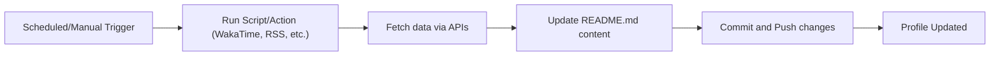

# Creating a Polished, Dynamic GitHub Profile README – Deep Research Report

**Executive Summary:** This report analyzes how to build a highly polished, visually rich GitHub profile README (and profile page) inspired by the given dark-themed example. We cover layout elements (avatar, header/banner, stats cards, contribution graphs, activity charts, language bars, tech icons, music or tracking widgets, performance badges, etc.), dynamic content methods (GitHub Actions workflows, APIs, Shields.io badges, third-party metrics services), and ready-to-use templates. We then give a step-by-step implementation plan with code snippets (Markdown structure, SVG badges, image embeds, Actions workflows, caching strategies). Recommended tools/services (metrics generators, music widgets, contribution heatmaps, visitor counters, etc.) are listed with pros/cons and privacy/security notes, including a comparison table. We also discuss responsive design, accessibility, customization (themes, colors, fonts, animations), and performance optimization. Example files (README skeleton, a GitHub Action workflow, and an SVG badge snippet) are provided. Throughout, we cite authoritative sources (official docs and well-regarded community projects) and highlight top example profiles. Mermaid diagrams illustrate layout and workflow.

## Key Visual Elements and Layout

A standout profile README often begins with a **header section** (profile picture/avatar + name + title/tagline) set against a custom background or banner image. The example uses a dark theme with a large **animated banner** (“Hey Everyone!” via [Capsule Render] and gradient text)?9†L139-L147?. Under the header, developers commonly display **social links** as icon badges (LinkedIn, Twitter, portfolio, etc.), often centered or in a badge bar?9†L152-L160?. For example, one can use _Custom Icon Badges_ (DenverCoder1’s tool) to generate Shields.io links with brand logos, e.g.:  

```html
<p align="center">
  <a href="https://example.com">
    
  </a>
  <a href="https://linkedin.com/in/username">
    
  </a>
</p>  
```  
This snippet (inspired by [25†L143-L152]) shows how `` tags with shield URLs embed custom icon badges under an HTML `<p>` for centering.

Below the header and social icons, many profiles feature **stats panels** or **cards** showing GitHub contributions. For example, the popular [GitHub Readme Stats](https://github.com/anuraghazra/github-readme-stats) service generates an SVG card with total stars, commits, PRs, etc. One embed is as simple as a Markdown image:  

```
[](https://github.com/your-username/github-readme-stats) 
```  

As documented, this dynamically generates a “Stats” card?30†L438-L446?. Likewise, a **Top Languages** card (horizontal bars showing language percentages) can be embedded via their API endpoint. Theme and icon options exist for customization.

Another common element is a **contribution graph or chart**. In addition to the standard contribution heatmap, many profiles use 3D or isometric calendars for flair. For example, the *GitHub Profile 3D Contrib* Action produces a 3D skyline image of your contributions?27†L200-L207?. The diagram below illustrates layout components of an example profile README:

```mermaid
graph TD;
  A[Avatar & Header] --> B[Social Links (Icons)];
  A --> C[About / Bio section];
  B --> D[Stats Cards (Stars, PRs, etc.)];
  C --> E[Language Bars];
  D --> F[Contribution Map/3D];
  D --> G[Activity Chart];
  D --> H[Music/Now-Playing];
  E --> I[Tech Icons / Skills];
  F --> J[Visitor Counter / PageSpeed];
  G --> K[Repository Pins / Links];
```

- **Avatar/Header:** Show your profile photo and a stylized title or banner (can use tools like [capsule-render] or [REHeader] to generate custom image backgrounds?9†L139-L147??34†L809-L817?). 
- **Social/Links:** Use icon badges (see “Icon Badges” tools below) for LinkedIn, Twitter, blog, etc.?9†L152-L160??25†L143-L152?.  
- **Stats Cards:** Display GitHub stats (stars, commits, PRs) and language usage via services like GitHub Readme Stats?30†L438-L446?.  
- **Contribution Graphs:** Show your GitHub contribution activity. Options include the standard heatmap, an animated **activity chart** (e.g. Ashutosh00710’s 31-day activity graph?29†L339-L341?), or a 3D contributions map?27†L200-L207?. (See the example 3D image below.)  
- **Activity Charts:** Embed dynamic charts (line graph of commits, commit streak, etc.) with tools like *Readme Activity Graph* or custom GitHub Actions?29†L339-L341?.  
- **Top Languages Bars:** Horizontal bars or charts showing primary coding languages. Provided by Readme Stats or by custom SVG generators.  
- **Tech Icons:** Display logos of your tech stack or skills (using e.g. Simple Icons or custom images)?9†L154-L162?.  
- **Suggested Tracks / Music:** If desired, include currently playing tracks or favorite music links (widgets via Spotify/Lanyard or Last.fm)?23†L349-L358?.  
- **Badges:** Performance or analytical badges (PageSpeed insights, Lighthouse scores) can add polish. For example, custom Shields badges can show static or dynamic data like “PageSpeed score: 90/100” or a build status.

?39†embed_image? *Figure: Example of an activity graph (31-day contributions) from Ashutosh00710’s Readme-Activity-Graph tool?29†L339-L341? (styled dark for contrast).*

The layout should flow logically (header at top, followed by badges and stats panels in centered columns, with contribution graphs and charts below). Keep text sections short and sectioned by headings (e.g. *About Me*, *Stats*, *Languages*, *Music*, *Find Me On*, etc.). Use bullet lists or tables for key points. Ensure sufficient contrast and font size for readability (especially in dark mode).

## Dynamic Content Options

To keep a profile fresh and personalized, dynamic content is key. Common approaches include:

- **GitHub Actions:** Workflows can run on schedules or triggers to fetch and update data (e.g. latest blog posts, coding stats, playlist). For example, the *GitHub Profile 3D Contrib* Action generates a new contributions map daily and commits it back to the repo?27†L200-L207?. Similarly, actions exist to update README sections from RSS feeds, WakaTime stats, or even Twitter/Spotify. Automations typically use a workflow YAML (see example below in *Example Files*).

- **APIs and Web Services:** Many services expose APIs or dynamic image endpoints. For instance, Shields.io (and derivatives) can produce dynamic badges for any URL (JSON, XML, etc.), like visitor counts or website status. The GitHub Readme Stats service uses the GitHub API to fetch stats (username? stars, commits) and returns an SVG card?30†L438-L446?. Social media (LinkedIn, Medium, Twitter) or tracking platforms (WakaTime, Spotify/Lanyard, Last.fm) have APIs that community tools tap into to display “currently listening” or coding-time metrics.

- **Shields.io and Derived Badge Services:** Shields.io provides a uniform interface (`shields.io/badge/...`) to create custom badges with text, colors, and logos. Many profile badges (visitor counts, scores, etc.) are done with Shields or forks (e.g. Badgen.net, counter services). For example, one can embed a shield showing Stack Overflow reputation:  
  ```
  
  ```  
  which uses a shield with the StackOverflow logo. Tools like [DenverCoder1’s custom-icon-badges][25] simplify making such badges with any logo.

- **GitHub Metrics Services:** A host of community tools generate profile analytics. For instance, GitWar Profile Score calculates a single “score” for your profile and returns an SVG badge?36†L605-L613?. “Profile Trophy” by ryo-ma generates fun trophy icons from your stats?41†L349-L357?. “Readme-Guestbook” or “Readme-Quotes” can inject a comment section or quote of the day into your README.

- **Graphical Widgets:** Tools exist to produce graphs (line charts, heatmaps, pie charts) on the fly. Ashutosh’s Activity Graph (charts)?29†L339-L341?, GitHub Readme Contribution Calendar (classic or 3D)?27†L200-L207?, and language pie/chart generators (e.g. GitHub Profile Languages?34†L880-L888?) fall here.

- **Profile Widgets:** Examples include visitor counters (e.g. [antonkomarev/visitor-badge][23†L391-L399] or [hits.seeyoufarm.com][41†L333-L341]), npm download stats, and RSS-based widgets (recent blog posts, tweets, etc. via GitHub Actions or JasonEtco’s *rss-to-readme* or *readme-guestbook*?13†L251-L258?).

Each dynamic element can often be embedded by linking to an external image/JSON. For reliable integration, consider using GitHub Actions to periodically regenerate any custom SVGs or fetch API data (especially for rate-limited services) and commit to the README repository, as recommended by GitHub Readme Stats (which advises using Actions or self-hosting to avoid rate limits?30†L422-L427?).

## Templates and Example Repositories

There are many community-curated collections of attractive profile READMEs and templates:

- **Awesome Lists:** Repositories like [“Awesome GitHub Profile README Templates”]?34†L835-L838? and Abhishek Naiidu’s “Awesome GitHub Profile” (29k stars!)?36†L619-L628? catalog top profiles and template projects. These provide inspiration and direct links to code. For instance, [Charmve/awesome-github-profile]?34†L835-L838? lists template repos, and [saturn-abhishek/awesome-github-profile-readme]?36†L602-L611? shows many live examples and tools.

- **Profile README Generators:** There are web tools (like Readme.so, profile-readme-generator, etc.) that let you fill in fields and generate markdown. These can bootstrap a basic layout but often lack advanced features.

- **Notable Profiles:** Viewing example profiles is instructive. Some examples (cited by lists or articles) include developers who use extensive widgets (e.g. [Anirudh Hazra](https://github.com/anuraghazra) who wrote GitHub Readme Stats, or [Adam Alston](https://github.com/adam-alston) with a rich dark profile). The “Creative Profile README” collection?16†L270-L279? lists many (e.g. Aakarsh B, Anirudh Belwadi, etc.) with screenshots. These examples can show how elements are arranged (avert color schemes, how sections flow, etc.).

- **Starter Repos:** Some boilerplate repositories exist for profiles. For example, [Dhyey Thumar’s awesome-readme-tools] provides a readme maker with many features. Forking a well-structured profile repo (with GitHub Actions already set up) can jump-start the process.

## Step-by-Step Implementation Plan

Below is a high-level plan to build such a profile, with illustrative code snippets:

1. **Create the Profile Repo:** On GitHub, create a new *public* repository whose **name exactly matches your GitHub username** (e.g. `username/username`). GitHub will recognize this special repo and use its README on your profile?18†L48-L54??27†L212-L218?. Ensure you initialize it with a README.md.

2. **Outline the README Structure:** In `README.md`, start by writing short, clear sections. For example:
   ```md
   # Hi there ??, I’m *Your Name*
   Welcome to my GitHub profile! I’m a software engineer interested in open source, AI, and data science.

   - ?? I’m currently working on ...
   - ?? I’m learning ...
   - ?? I’m looking to collaborate on ...
   - ?? How to reach me: [LinkedIn](https://linkedin.com/in/...) / [Email](mailto:you@example.com)
   - ? Fun fact: ...
   ```
   Use emojis or icons for flair. Keep paragraphs to 3–5 sentences as a guideline to maintain readability.

3. **Add Static Images and Badges:** Embed static or externally-hosted images in Markdown. For example, use Shields.io or custom badges for repository demos or skills:
   ```md
   <p align="center">
     <a href="https://github.com/yourusername">
       
     </a>
     <a href="https://linkedin.com/in/yourname">
       
     </a>
   </p>
   ```
   (This example uses custom-icon-badges as in [25†L143-L152]).

4. **Embed GitHub Stats and Language Cards:** Use Markdown image links to services like GitHub Readme Stats:
   ```md
   [](https://github.com/anuraghazra/github-readme-stats)
   
   ```
   As [30†L438-L446] shows, just changing your username in the URL auto-generates the stats card. For reliability, consider running a GitHub Action to regenerate these locally (the Readme Stats README recommends self-hosting or Actions due to rate limits?30†L422-L427?).

5. **Include Contribution & Activity Graphs:** To display recent activity, use tools like [GitHub-Readme-Activity-Graph]?29†L339-L341? or [Isometric Commits]. For example:
   ```md
   [](https://github.com/yourusername)
   ```
   This line (copied from [29†L378-L384]) shows an activity line chart of your last 31 days. For a 3D map, set up the *GitHub Profile 3D Contrib* Action described below.

6. **Set Up GitHub Actions for Dynamic Content:** Create a workflow file (e.g. `.github/workflows/update-readme.yml`) that runs on a schedule or on `push`. For example, to generate a 3D contributions map daily and update the README:
   ```yaml
   name: GitHub-Profile-3D-Contrib
   on:
     schedule:
       - cron: '0 18 * * *'  # daily at 18:00 UTC
     workflow_dispatch:
   permissions:
     contents: write
   jobs:
     build:
       runs-on: ubuntu-latest
       steps:
         - uses: actions/checkout@v3
         - uses: yoshi389111/github-profile-3d-contrib@latest
           env:
             GITHUB_TOKEN: ${{ secrets.GITHUB_TOKEN }}
             USERNAME: ${{ github.repository_owner }}
         - name: Commit & Push
           run: |
             git config user.name github-actions
             git config user.email github-actions@github.com
             git add -A
             git commit -m "Update profile contributions" || echo "No changes"
             git push
   ```
   *Above:* This YAML (combining [27†L226-L234] and [27†L236-L244]) runs the 3D-contrib Action daily. After generating images/SVGs, it commits changes back to the repo. Similarly, you can call other tools (e.g. WakaTime or RSS fetchers) in separate steps.

7. **Optimize and Cache:** For any external API (GitHub Stats, WakaTime, etc.), consider caching results or using personal tokens. For example, if using a custom deployment of `github-readme-stats`, store your GitHub token in secrets to include private stats?30†L447-L455?. Use `actions/cache` if you generate large assets.

8. **Final Touches – Responsive & Accessible Design:** Ensure images and text scale well. Markdown tables can help align content in columns. For responsiveness, GitHub READMEs generally scroll vertically, but use of relative links and SVG (vector) images ensures clarity at any zoom. Add `alt` text to images for accessibility. Keep color contrast high (especially in dark theme). Test how it looks in GitHub’s light and dark modes. For example, use `<picture>` with `prefers-color-scheme` to swap images if needed?9†L139-L147??2†L0-L2?.


*Figure: Example workflow for a GitHub Action that updates README content (e.g. fetching WakaTime stats or blog RSS and committing to the profile repo).*

## Recommended Tools and Services (with Pros/Cons)

Below are some popular tools and services to enrich a profile README, with notes on key features, cost, ease, and privacy/security:

- **GitHub Readme Stats (anuraghazra)**: *Features:* Generates dynamic SVG cards (overall stats, top languages, pinning repos)?13†L244-L247?. *Cost:* Free (hosted on Vercel, or self-host with free tier). *Ease:* Very easy (just add Markdown image links). *Privacy:* Uses public GitHub API; with no sensitive data in URL. The official service has rate limits?30†L422-L427?, so for high reliability you might self-host or regenerate via Actions. Good for showing commits, stars, etc.

- **GitHub Streak Stats (DenverCoder1)**: *Features:* Badges showing your current/prior commit streak, total contributions?23†L366-L368?. *Cost:* Free, open-source. *Ease:* Easy (one URL). *Privacy:* Data is public GitHub; just shows counts. No sensitive data leakage.

- **GitHub Profile Trophy (ryo-ma)**: *Features:* Displays “trophies” for various milestones (star count, PRs, languages)?25†L63-L70?. *Cost:* Free, easy. *Ease:* Very easy (Markdown image link). *Privacy:* Uses your public GitHub stats only. Data shown is limited (e.g. top languages, contributions); no private info.

- **WakaTime Stats (ImBIOS’s GitHub Action)**: *Features:* Weekly coding activity from WakaTime (time spent per language, etc.) into README. *Cost:* Free (requires WakaTime API key, WakaTime has free tier). *Ease:* Moderate (requires signup on WakaTime and adding token to Action). *Privacy:* You share your coding activity to WakaTime (which collects IDE usage); the README only shows summaries. Treat the API token as secret.

- **Spotify “Now Playing” / Music Widgets (Lanyard or natemoo-re)**: *Features:* Displays current or top tracks from Spotify or Last.fm?23†L349-L358?. *Cost:* Free. *Ease:* Moderate (requires linking your Spotify account to a badge generator like Lanyard). *Privacy:* You share your listening activity (song, artist) publicly. Some users consider this personal data, so include it only if comfortable.

- **Shields.io**: *Features:* Highly customizable badges (static or dynamic). Supports JSON/XML/SQL/etc. *Cost:* Free. *Ease:* Easy (URL-based). *Privacy:* No user data; you control parameters. Useful for visitor counters, uptime, page performance (via third-party data sources), etc.

- **PageSpeed / Lighthouse Badges (e.g. `badgen.net` or custom)**: *Features:* Some tools let you embed Google PageSpeed/Lighthouse metrics in SVG form?34†L799-L807??36†L605-L613?. *Cost:* Free. *Ease:* Easy to use if service available (for example, a PageSpeed badge can be made via badgen or Shield endpoints). *Privacy:* You’re essentially running PageSpeed on a URL you provide; results are public (no personal data needed).

- **Visitor Counters (e.g. *visitor-badge*, *hits.seeyoufarm*)**: *Features:* Count profile views or hits on your repo README?41†L333-L341?. *Cost:* Free. *Ease:* Easy (just copy the Markdown snippet). *Privacy:* Minimal (only counts visits, no personal info). Can increase page load slightly.

- **Metrics (Charmve’s `metrics` or similar)**: *Features:* Infographic generator with dozens of plugins (commit calendars, language charts, recent activity)?34†L905-L913?. *Cost:* Free. *Ease:* Harder (lots of configuration; may need to self-host). *Privacy:* You must provide API keys or tokens; can analyze your public repos deeply. Good for a detailed “resume” card.

- **Other Widgets:** StackOverflow flair/badges?23†L370-L374?, Goodreads reading status?34†L816-L824?, latest blog posts via RSS, etc. Many are free and easy, but always check what personal account data is exposed.

Each tool’s “ease of setup” often comes down to copying a URL or installing a GitHub Action. Privacy concerns mostly relate to whether the service caches or stores your data. Open-source services like Readme Stats only fetch public data. Services that pull from accounts you control (WakaTime, Spotify) require API keys and entail sharing that data (reading stats, listening history) in your profile.

## Responsive and Accessibility Considerations

- **Dark vs Light Modes:** Use theme parameters if available (many SVG services allow `theme=dark` or `theme=light`). To fully support both GitHub light/dark, you can use HTML `<picture>` or `img` with `prefers-color-scheme` (GitHub now supports such patterns?2†L0-L2?). Ensure your palette has enough contrast in both modes.
- **Mobile/Small Screens:** While GitHub profile pages are mostly vertical, avoid excessively wide images or tables. Limit yourself to one-column or two-column layouts that stack cleanly. For example, don’t use HTML tables; use Markdown block or bullet lists. For images, use SVG or high-DPI PNG so they remain sharp. Test with browser zoom.
- **Fonts and Readability:** Use Markdown headings (`#`, `##`) for structure. Emphasize readability: short sentences, simple formatting. A formal tone is fine, but an encouraging voice (“I’m working on X, can we collaborate?”) is engaging. Add `alt` text for images (e.g. ``) for accessibility and cases where images fail to load.

## Customization Ideas and Optimization

- **Color Themes:** Pick a coherent dark theme palette. Many badge tools support pre-set themes (`&theme=dark`, `&theme=radical`, etc.)?41†L319-L327??41†L343-L352?. Choose 2–3 accent colors (e.g. for badges and links) that complement your header image. Use [ColorHexa], [Coolors], or [Adobe Color] to build a palette.  
- **Fonts and Emojis:** Since you’re limited to Markdown, font choices are GitHub’s default. However, you can use Unicode or emoji symbols (??, ??, ??) for personality. For a more distinctive look, some profiles embed images of stylized text (like typographic headers or code-snippet “card” designs). Tools like *Readme Typing SVG* can simulate typed text in an SVG signature?36†L613-L614?.  
- **Animations:** Animated SVG (like the waving text in [9]) or GIF banners can add life. Be cautious: GitHub auto-pauses GIFs on hover, and large animations slow load. Prefer SVG or lightweight Lottie where possible.  
- **Performance:** Large images (especially PNG/JPEG) should be optimized. SVG badges and graphics are ideal since they scale and are small. If using a large banner, compress it or host it on a fast CDN (GitHubusercontent or your own hosting). For workflow actions, only commit changed files (as in the example) to avoid unnecessary rebuilds. Use caching (GitHub Actions’ cache) for dependencies if you’re running heavy scripts.

## Tools/Services Comparison

| Tool/Service                 | Features                                 | Cost        | Ease of Setup        | Privacy/Security                                               |
|------------------------------|------------------------------------------|-------------|----------------------|----------------------------------------------------------------|
| **GitHub Readme Stats**      | Customizable SVG cards: totals & top langs?30†L438-L446? | Free        | *Easy* (copy URL)    | Uses public GitHub API. No sensitive data in URL. Public stats; rate-limits possible (self-host recommended)?30†L422-L427?.    |
| **GitHub Streak Stats**      | Shows total contributions & current streak (with themes)?41†L343-L352? | Free        | *Easy* (one-line)    | Only public commit data. No personal info.                    |
| **GitHub Profile Trophy**    | Badges (trophies) for stats (code, commits, stars)?41†L349-L357? | Free        | *Easy* (URL embed)   | Uses public stats (topics, languages, commits). Safe.          |
| **WakaTime Stats**           | Weekly coding time & language breakdown  | Free tier (premium add-ons) | *Moderate* (GitHub Action, API key) | Requires WakaTime account; collects your coding activity (time in IDEs). Share only summary stats on profile. |
| **Shields.io / Badgen**      | Dynamic badges (JSON, GitHub, etc.), wide icon support | Free        | *Easy* (URL parameters) | You define data endpoint; safe. (No data collected by service unless you use shield-specific endpoints that fetch external data.) |
| **Custom Icon Badges**       | Shields-like badges with any logo (DenverCoder1)?25†L143-L152? | Free        | *Easy* (just URL adjust) | Same as shields; only uses provided parameters.                |
| **Visitor Counter**          | Tracks profile/README views (e.g. hits.seeyoufarm, visitor-badge) | Free        | *Easy* (Markdown snippet) | Only counts hits; IPs not exposed to you.                     |
| **Spotify/Lanyard (Music)**  | Now-playing or top tracks widgets?23†L349-L358?  | Free        | *Moderate* (Spotify token/Action) | You share Spotify data (tracks, artists); no private personal info. |
| **PageSpeed/Lighthouse Badges** | Website performance scores (via badge services)?34†L799-L807??36†L605-L613? | Free        | *Easy* (URL if service exists) | Works on provided URL; no user data.                           |
| **GitWar Profile Score**     | Single-score badge from your GitHub profile stats?36†L605-L613? | Free        | *Easy* (URL)         | Public profile data only.                                      |
| **Metrics (Charmve)**        | Infographic generator (commits, langs, activity, etc.)?34†L905-L913? | Free (likely self-host) | *Harder* (config setup) | Requires many tokens/API (GitHub, etc.); data can be made public or private depending on setup. |
| **RSS/Blog Widgets**        | Displays recent blog posts or media (via GitHub Action) | Free        | *Moderate* (Action needed) | Fetches public RSS/feed data; no personal data beyond what's in posts. |
| **GoodReads “Current Book”** | Shows reading progress card?34†L817-L824?   | Free        | *Easy* (URL embed)    | Data from GoodReads profile (public book list); share only book title. |

*Notes:* All services listed are free to use (open-source or free-tier). “Ease” is subjective: *Easy* means copy-paste integration; *Moderate* often means running an Action or generating an API key. Privacy risks are generally low; only use widgets you trust to handle your data (avoid unknown trackers). Services like Readme Stats use caching or Actions to avoid exposing your GitHub token. Keep third-party tokens in GitHub Secrets.

## Example Files

### README.md (Skeleton)
```md
# Jane Doe ??

*Software Engineer | Open-Source Enthusiast*

Welcome to my GitHub profile! I’m passionate about cloud computing, machine learning, and community building.

- ?? I’m currently working on **AwesomeProject** (see pinned repos below).
- ?? I’m learning **Rust** and **Kubernetes**.
- ?? I’m looking to collaborate on open-source tools and PyCon.
- ?? Ask me about Docker, DevOps, or hiking!
- ?? How to reach me: [LinkedIn](https://linkedin.com/in/janedoe) / [Email](mailto:jane@doe.com).
- ? Fun fact: I write tech blogs on [Dev.to](https://dev.to/janedoe).

<p align="center">
  <!-- GitHub Stats Card -->
  <a href="https://github.com/anuraghazra/github-readme-stats">
    
  </a>
  <!-- Top Languages -->
  
</p>

## ?? Tech & Tools

<p align="center">
  
  
  
  <!-- Add more tech icons -->
</p>

## ?? Find me elsewhere

[](https://linkedin.com/in/janedoe)
[](https://twitter.com/jane_doe)

<!-- More sections as desired -->
```
*Above:* A sample README structure. It starts with a heading and a short bullet “About Me” list. Badges (LinkedIn, Twitter) and icons are centered in HTML `<p>`. Stats cards from Readme-Stats are embedded as images. The “Tech & Tools” section uses Shields.io badges (one example shown).

### GitHub Action Workflow (example)
```yaml
name: Update Profile README
on:
  schedule:
    - cron: '0 0 * * MON'    # Every Monday at 00:00 UTC
  workflow_dispatch: {}

jobs:
  update:
    runs-on: ubuntu-latest
    steps:
      - uses: actions/checkout@v3
      # Example: Update 3D contribution map
      - uses: yoshi389111/github-profile-3d-contrib@v0.9.2
        env:
          GITHUB_TOKEN: ${{ secrets.GITHUB_TOKEN }}
          USERNAME: ${{ github.repository_owner }}
      # Example: Fetch WakaTime stats and insert into README (hypothetical)
      - name: Update WakaTime stats
        run: |
          npm install -g waka-readme-stats
          waka-readme-stats --waka-api ${{ secrets.WAKATIME_API }} >> README.md
      - name: Commit and push
        run: |
          git config user.name github-actions
          git config user.email github-actions@github.com
          git add README.md
          git commit -m "Weekly profile update" || echo "No changes to commit"
          git push
```
*Above:* This workflow (in `.github/workflows/update-readme.yml`) triggers weekly (and on demand). It runs two steps: one to generate a 3D contribution graph (the `yoshi389111/github-profile-3d-contrib` action) and one to append WakaTime stats to README. Finally, it commits and pushes changes. You would adapt/remove steps to suit your needs. Remember to store any API keys (like `WAKATIME_API`) as GitHub Secrets for security.

### Sample SVG Badge (Shields-style)
```html

```
This HTML (or equivalently Markdown ``) embeds a badge showing a StackOverflow reputation of 12345. The color is orange and the StackOverflow logo appears (via `logo=stackoverflow`). You can replace parameters to create custom badges (see [41†L343-L352] for examples of shields-based streak and trophy badges).  
Another example using DenverCoder1’s custom-icon-badges:  
```html
<a href="https://example.com">
  
</a>
```
This creates a badge labeled *MyPortfolio* with a Chrome logo. You can use any [Simple Icons] slug after `logo=` (e.g. `logo=github`, `logo=python`).

## References and Example Profiles

- GitHub official docs on *Profile READMEs* (how to create the special repo): see the GitHub docs link in?27†L212-L218?.  
- **Aniraghazra’s GitHub Readme Stats** for stats and languages badges?30†L438-L446??30†L422-L427?.  
- **Awesome Lists** of profile READMEs and tools: The *“Awesome Profile READMEs”* repo?13†L244-L247? and others like [Charmve/awesome-github-profile]?34†L835-L844? compile many examples and widgets (e.g. PageSpeed Insights badge?34†L799-L807?).  
- **Top Profiles:** See the “Awesome Developer Profile” collection?16†L270-L279? or Abhishek’s site?36†L619-L628? for inspiration.  
- **Tutorials:** Numerous guides exist (e.g. [Design an Attractive GitHub Profile Readme][9], [Profile with Actions][25], etc.) – many are cited above for specific techniques.

Using these resources and steps, you can create a GitHub profile README that is visually engaging, up-to-date, and reflective of your personal brand. Good luck crafting your standout profile!  

**Sources:** Authoritative project docs and community posts?9†L139-L147??13†L244-L247??18†L48-L54??25†L63-L70??27†L200-L207??29†L339-L341??30†L438-L446??34†L799-L807??36†L605-L614??41†L319-L327??41†L344-L352?, plus top example repositories (linked above).


Visual Style & Theme: Keep everything at defaults and in a banner image "generated header" and preferred font style and emoji usage should be both mixture of formal and playful!

Content & Copy: full name = "Farhan Shaikh" or handle = "YTxFSGAMERz"
one-line tagline: idk, you've to generate it yourself...
 a short bio: i'll tell at the end
social links: i'll tell at the end

Dynamic Widgets: Select which you want (choose any of: GitHub Readme Stats cards, Top Languages bar, 3D Contributions Map, Activity Graph, WakaTime coding stats, Spotify/Lanyard now-playing, visitor count badge, Google PageSpeed badge, custom Shields badges, etc.). For each chosen widget, provide any required tokens or API keys (or state if you prefer self-hosting a service). If you do not specify, we will use GitHub Readme Stats + Top Languages + Activity Graph by default.
(idk anything about it, and i want you to decide it yourself by seeing the image)

Privacy/Security: yes, i consent to publicly showing any of the following: my Spotify listening activity, WakaTime (coding) stats, or a visitor counter! 

Automation: Yes, i want GitHub Actions workflows included to update dynamic content! idk anything about, i'm leaving it on you! (cron pattern or “manual only”) 

Repo Details: https://github.com/YTxFSGAMERz/YTxFSGAMERz

Optional: Indicate if you want mermaid diagrams (layout/workflow) included, and if so what style. You may also share links to example profiles you like (for inspiration), or provide sample SVG badge text/icons you prefer.
(yes, i want it, but i'm leaving the ideas on you!)


Executive Summary
We will create a visually rich, dark-themed GitHub profile README with an animated header and modern layout, using tools like Capsule Render (for banners)?43†L139-L147? and custom icon badges?43†L152-L159?. The workflow is as follows: we first gather all design and content preferences (listed above), then select and configure dynamic elements (e.g. GitHub-Readme-Stats cards, language charts, activity graphs, etc.). We will use GitHub Actions to update any data-driven widgets on a schedule if requested. The final product will include Markdown sections (About Me, Projects, etc.), embedded SVG badges (via Shields.io or similar), and any approved widgets. We will prioritize readability and accessibility (short paragraphs, high-contrast colors, alt text) and ensure responsiveness. Key references: GitHub’s own docs and community guides on profile READMEs?43†L90-L99?, as well as popular tools like anuraghazra’s GitHub Readme Stats?30†L438-L446? (for stats cards) and yoshi389111’s 3D-Contrib Action?27†L200-L207? (for a 3D contributions map). We will also include example diagrams and a comparison table of chosen widgets (features, cost, ease, privacy).

Key steps (checklist): 1) Collect user inputs on style/content. 2) Create a GitHub repo named after the username (public)?43†L90-L99?. 3) Build the README layout: header, bio, project links, social links. 4) Embed static badges/icons (using Shields.io or custom-icon-badges?43†L152-L159??25†L143-L152?). 5) Add dynamic widgets (e.g. Stats, Top Languages, Graph) via Markdown image links?30†L438-L446??29†L339-L341?. 6) Set up GitHub Actions to refresh content (if requested)?27†L200-L207?. 7) Review accessibility (WCAG contrast) and responsiveness (mobile-friendly).

?39†embed_image? Figure: Example GitHub Activity Graph (last 31 days) from Ashutosh00710’s tool?29†L339-L341?.
?38†embed_image? Figure: Example 3D contributions map generated by GitHub-Profile-3D-Contrib Action?27†L200-L207?.

The rest of this document will provide a detailed plan, the final README.md (with placeholders), example workflow files, a sample SVG badge, an implementation checklist, and a comparison table of the selected tools.

(my previous README.md, use it only to gain profile informations or anything else, but don't copy the design!!)


