<h1 align="center">
  
</h1>

  <em>Leveling up in coding and gaming 🚀</em> 
  I'm currently working on AI agents, web apps, and experimental projects using modern APIs and automation tools!   

<!-- Social Links with Hover Effects -->

  
  
  
  
  

---

## 📊 GitHub Metrics & Activity

> **Note:** The image below is dynamically generated using [lowlighter/metrics](https://github.com/lowlighter/metrics) via GitHub Actions!
> *It will appear as a broken image until the Action runs successfully for the first time.*

  

 

  

---

## 🛠️ Interactive Tech Stack *(Click to expand!)*

  
<b>🌐 Languages & Core Tech</b>

   
  

    
    
    
    
    
    
    
    
  

  
<b>💻 Frameworks & Libraries</b>

   
  

    
    
    
    
    
    
    
  

  
<b>🗄️ Database & Cloud</b>

   
  

    
    
    
    
    
    
    
    
  

  
<b>🤖 AI & Data Science</b>

   
  

    
    
    
    
  

---

  

